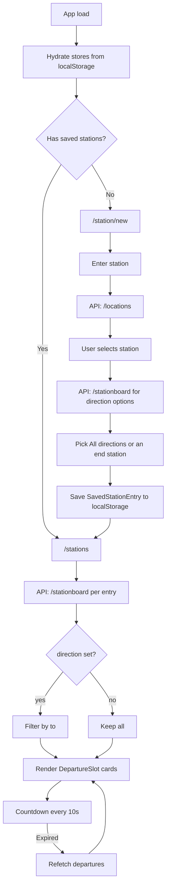

# Nexteli V2 — AI-Implementable Specification

## 1. Project Overview

**Nexteli** is a responsive static web app (PWA) for Swiss commuters. Users save stations (optionally filtered by direction) and see upcoming train, tram, and bus departures on a dashboard — without accounts or a backend.

**Core value:** Same stations every day; until schedules are memorized, you need quick access to the next departure. Nexteli answers that in one screen.

**Legacy reference:** `/Users/francoisweber/workspace/spielplatz/nexteli/` — vanilla JS PWA with `localStorage`, DOM templates, and one Web Component (`<departure-slot>`). V2 modernizes this with Vue 3, TypeScript, Pinia, Vue Router, and vue-i18n.

**Constraints:**
- No backend, no auth, no analytics
- All user data in `localStorage` only
- Live timetable data from [transport.opendata.ch](https://transport.opendata.ch/v1/) (public, rate-limited)
- Privacy: no tracking or transmission of user data beyond API calls

---

## 2. Tech Stack

| Package | Role |
|---------|------|
| `pnpm` | Package manager (always use `pnpm`, not npm) |
| `vite` | Dev server and production build |
| `vue` | UI framework (Composition API only) |
| `vue-router` | Client-side routing |
| `pinia` | State management |
| `vue-i18n` | Translations (de, en, es, fr, it, gsw) |
| `typescript` | Type safety |
| `tailwindcss` + `@tailwindcss/vite` | Utility-first CSS (v4, CSS-first config) |
| `daisyui` | Component themes and UI primitives |
| `lucide-vue-next` | Icons |
| `@vueuse/motion` | Subtle enter/transition animations |
| `vue-tsc` | Type-check before build |

**Scripts** (`package.json`):
- `pnpm dev` — Vite dev server
- `pnpm build` — `vue-tsc -b && vite build`

---

## 3. File / Folder Structure

```
nexteli-v2/
├── index.html
├── public/
│   ├── pwa-192x192.png
│   ├── pwa-512x512.png
│   └── apple-touch-icon.png
├── src/
│   ├── assets/
│   ├── components/
│   │   ├── AppHeader.vue
│   │   ├── DepartureSlot.vue
│   │   ├── LanguageSwitcher.vue
│   │   ├── StationCard.vue
│   │   ├── StationSearch.vue
│   │   └── ThemeToggle.vue
│   ├── composables/
│   │   ├── useCountdown.ts
│   │   ├── useStations.ts
│   │   └── useTransportApi.ts
│   ├── locales/
│   │   ├── de.json
│   │   ├── en.json
│   │   ├── es.json
│   │   ├── fr.json
│   │   ├── gsw.json
│   │   └── it.json
│   ├── pages/
│   │   ├── EditStationPage.vue
│   │   ├── NewStationPage.vue
│   │   ├── StationsPage.vue
│   │   └── SettingsPage.vue
│   ├── router/
│   │   └── index.ts
│   ├── stores/
│   │   ├── stations.ts
│   │   └── settings.ts
│   ├── types/
│   │   ├── itinerary.ts
│   │   └── transport.ts
│   ├── utils/
│   │   ├── format.ts
│   │   └── storage.ts
│   ├── App.vue
│   ├── app.css
│   ├── env.d.ts
│   └── main.ts
├── Design.md
├── package.json
├── tsconfig.json
└── vite.config.ts
```

**Path alias:** `@/` → `src/`.

---

## 4. TypeScript Interfaces

### `src/types/transport.ts` — API shapes

Includes `Station`, `LocationsResponse`, `StationboardEntry`, `StationboardResponse`, and related checkpoint/journey types. Stationboard is the primary live-data source.

### `src/types/itinerary.ts` — App domain shapes

```typescript
export interface SavedStation {
  id: string
  name: string
  icon?: string
}

export interface SavedStationEntry {
  id: string                 // `${station.id}::${direction ?? '*'}`
  createdAt: number
  station: SavedStation
  direction: string | null   // proposed end-station name, or null = all directions
}

export interface FormattedDeparture {
  line: string
  mode: TransportMode
  to: string
  departure: {
    iso: string
    timestampMs: number
    platform: string | null
  }
  minutesUntilDeparture: number
  countdownLabel: string
}

export interface StationEntryWithDepartures extends SavedStationEntry {
  departures: FormattedDeparture[]
  loading: boolean
  error: string | null
  lastFetchedAt: number | null
}
```

### localStorage keys

| Key | Type | Default |
|-----|------|---------|
| `nexteli:stations` | `SavedStationEntry[]` | `[]` |
| `nexteli:settings` | `AppSettings` | `{ locale: browser, theme: 'nexteli' }` |

---

## 5. API Service Layer

**File:** `src/composables/useTransportApi.ts`

**Base URL:** `https://transport.opendata.ch/v1`

### Functions

```typescript
async function searchStations(query: string): Promise<Station[]>
// GET /locations?query={query}&type=station

async function getStationboard(stationId: string, limit?: number): Promise<FormattedDeparture[]>
// GET /stationboard?id={stationId}&limit={limit}
```

Map each `StationboardEntry` → `FormattedDeparture` (line, mode via `categoryToMode`, `to`, departure time/platform, countdown). Filter past departures (keep within last 60s as "now"), sort ascending.

### Direction options

`getDirectionOptions(stationId)` (in `useStations`) calls `getStationboard(stationId, 30)` and returns unique `to` values in first-seen order. Used when adding/editing a station so the user can pick a direction (end station of the line).

---

## 6. State Management (Pinia)

### `src/stores/stations.ts` — `useStationsStore`

**State:** `stations`, `departuresByEntryId`, `loadingIds`, `errorsById`, `lastFetchedAtById`

**Actions:** `hydrate`, `addStation(station, direction)`, `removeStation`, `clearAll`, `setStationOrder`, `fetchDepartures` (optional direction filter + slice to 6, 30s cache), `refreshAll`

**Entry ID:** `${station.id}::${direction ?? '*'}`

### `src/stores/settings.ts` — `useSettingsStore`

Locale, theme, and `clearAllData()` (also clears stations store).

---

## 7. Composables

### `useTransportApi()`

`{ searchStations, getStationboard, loading, error }`

### `useStations()`

`{ stationEntries, savedStations, hasStations, addStation, removeStation, refreshStation, refreshAll, setStationOrder, getDirectionOptions }`

### `useCountdown(departureTimestampMs)`

Live countdown label; emits expired when departure has passed.

---

## 8. Components

### `AppHeader.vue`

Logo → `/stations` or `/station/new`. CTA: "Add station" → `/station/new`.

### `StationSearch.vue`

Debounced autocomplete against `/locations`.

### `DepartureSlot.vue`

Shows line, countdown, departure time, destination (`to`), platform.

### `StationCard.vue`

Header: station name + direction (or "All directions"). Horizontal scroll of `DepartureSlot`s. Menu: refresh / remove.

---

## 9. Pages / Router

| Path | Component |
|------|-----------|
| `/stations` | `StationsPage.vue` |
| `/station/new` | `NewStationPage.vue` |
| `/stations/edit/:id` | `EditStationPage.vue` |
| `/settings` | `SettingsPage.vue` |

**Add flow:** pick station → load direction chips from stationboard → save with optional direction filter.

**Guard:** `/stations` when empty → `/station/new`.

---

## 10. i18n

Namespaces: `nav`, `about`, `station`, `stations`, `departure`, `settings`, `errors`, `common`.

Locales: `de`, `en`, `es`, `fr`, `it`, `gsw`.

---

## Appendix A: User Flow



---

## Appendix B: Legacy → V2 Mapping

| Legacy | V2 |
|--------|-----|
| `Itinerary` class | `SavedStationEntry` + `useStationsStore` |
| `transport.js` | `useTransportApi` (`/stationboard`) |
| `<departure-slot>` | `DepartureSlot.vue` |
| `localStorage "itineraries"` | `localStorage "nexteli:stations"` |

---

## Appendix C: Acceptance Criteria

- [ ] First visit shows `/station/new` with about section and working station search
- [ ] After picking a station, direction options (end stations) are proposed from the stationboard
- [ ] Adding a station (with or without direction) persists and shows on `/stations`
- [ ] Dashboard shows next departures with live countdown
- [ ] Expired departures disappear and new ones load after refetch
- [ ] User can remove a station with confirmation
- [ ] Settings: language / theme / clear all work
- [ ] `pnpm build` completes without type errors
- [ ] PWA manifest shows "Nexteli"
