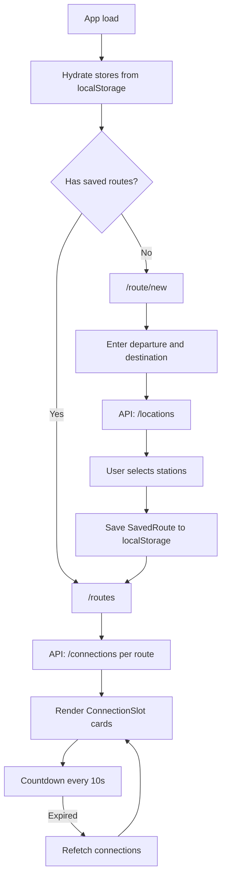

# Nexteli V2 — AI-Implementable Specification

## 1. Project Overview

**Nexteli** is a responsive static web app (PWA) for Swiss commuters. Users save recurring routes (departure → destination) and see upcoming train, tram, and bus departures on a dashboard — without accounts or a backend.

**Core value:** Same routes every day; until schedules are memorized, you need quick access to the next departure. Nexteli answers that in one screen.

**Legacy reference:** `/Users/francoisweber/workspace/spielplatz/nexteli/` — vanilla JS PWA with `localStorage`, DOM templates, and one Web Component (`<departure-slot>`). V2 modernizes this with Vue 3, TypeScript, Pinia, Vue Router, and vue-i18n.

**Constraints:**
- No backend, no auth, no analytics
- All user data in `localStorage` only
- Live timetable data from [transport.opendata.ch](https://transport.opendata.ch/v1/) (public, rate-limited)
- Privacy: no tracking or transmission of user data beyond API calls

---

## 2. Tech Stack

| Package | Role |
|---------|------|
| `pnpm` | Package manager (always use `pnpm`, not npm) |
| `vite` | Dev server and production build |
| `vue` | UI framework (Composition API only) |
| `vue-router` | Client-side routing |
| `pinia` | State management |
| `vue-i18n` | Translations (de, fr, it, gsw) |
| `typescript` | Type safety |
| `tailwindcss` + `@tailwindcss/vite` | Utility-first CSS (v4, CSS-first config) |
| `daisyui` | Component themes and UI primitives |
| `lucide-vue-next` | Icons |
| `@vueuse/motion` | Subtle enter/transition animations |
| `vue-tsc` | Type-check before build |

**Scripts** (`package.json`):
- `pnpm dev` — Vite dev server
- `pnpm build` — `vue-tsc -b && vite build`

### Config cleanup required before first build

[`vite.config.ts`](vite.config.ts) is partially scaffolded from another project and must be fixed during implementation (step 14):

1. **`vite-plugin-pwa`** is imported and configured but **not listed in `package.json`** — add it as a devDependency or remove the plugin block until PWA is implemented.
2. **PWA manifest** still says **"Pawlulu"** (dog baby book app) — replace with Nexteli branding (see §12).
3. **`vitest`** is referenced in `vite.config.ts` (`/// <reference types="vitest/config" />`, `test` block) but is **not in `package.json`** — remove test config or add vitest.
4. **`dev.sh`** is referenced by `dev:local` script but **does not exist** — create it or remove the script.
5. **`calendar-*` custom element** compiler option in Vue plugin is leftover — remove unless needed.
6. **Missing root files:** `index.html`, `src/`, `public/` — scaffold in step 1.

---

## 3. File / Folder Structure

Create this exact tree under the project root:

```
nexteli-v2/
├── index.html
├── public/
│   ├── pwa-192x192.png
│   ├── pwa-512x512.png
│   └── apple-touch-icon.png
├── src/
│   ├── assets/                    # optional static images
│   ├── components/
│   │   ├── AppHeader.vue
│   │   ├── ConnectionSlot.vue
│   │   ├── LanguageSwitcher.vue
│   │   ├── RouteCard.vue
│   │   ├── StationSearch.vue
│   │   └── ThemeToggle.vue
│   ├── composables/
│   │   ├── useCountdown.ts
│   │   ├── useItineraries.ts
│   │   └── useTransportApi.ts
│   ├── locales/
│   │   ├── de.json
│   │   ├── fr.json
│   │   ├── gsw.json
│   │   └── it.json
│   ├── pages/
│   │   ├── EditRoutePage.vue
│   │   ├── NewRoutePage.vue
│   │   ├── RoutesPage.vue
│   │   └── SettingsPage.vue
│   ├── router/
│   │   └── index.ts
│   ├── stores/
│   │   ├── itineraries.ts
│   │   └── settings.ts
│   ├── types/
│   │   ├── itinerary.ts
│   │   └── transport.ts
│   ├── utils/
│   │   ├── format.ts              # time/duration formatting
│   │   └── storage.ts             # localStorage helpers
│   ├── App.vue
│   ├── app.css                    # Tailwind + DaisyUI entry
│   ├── env.d.ts                   # Vite client types
│   └── main.ts
├── Design.md
├── package.json
├── tsconfig.json
└── vite.config.ts
```

**Path alias:** `@/` → `src/` (already configured in `tsconfig.json` and `vite.config.ts`).

---

## 4. TypeScript Interfaces

### `src/types/transport.ts` — API shapes

```typescript
/** WGS84 coordinates from transport.opendata.ch */
export interface Coordinates {
  type: 'WGS84'
  x: number  // latitude
  y: number  // longitude
}

/** Station / location from GET /locations */
export interface Station {
  id: string
  name: string
  score: number | null
  coordinate: Coordinates
  distance?: number | null
  icon?: string  // e.g. "train", "tram", "bus" — when present
}

export interface LocationsResponse {
  stations: Station[]
}

export interface Prognosis {
  platform: string | null
  arrival: string | null
  departure: string | null
  capacity1st: string | null
  capacity2nd: string | null
}

/** Arrival or departure checkpoint on a connection */
export interface ConnectionCheckpoint {
  station: Station
  arrival: string | null
  arrivalTimestamp: number | null
  departure: string | null
  departureTimestamp: number | null
  platform: string | null
  prognosis: Prognosis
}

export interface Journey {
  name: string
  category: string       // e.g. "S", "BUS", "T"
  categoryCode: string
  number: string
  operator: string | null
  to: string
}

export interface Section {
  journey: Journey | null
  walk: unknown | null
  departure: ConnectionCheckpoint
  arrival: ConnectionCheckpoint
}

export interface Connection {
  from: ConnectionCheckpoint
  to: ConnectionCheckpoint
  duration: string       // e.g. "00d00:43:00"
  products: string[]   // e.g. ["IR", "S9"]
  sections: Section[]
}

export interface ConnectionsResponse {
  connections: Connection[]
}

/** GET /stationboard — optional, for future use */
export interface StationboardEntry {
  stop: ConnectionCheckpoint
  name: string
  category: string
  number: string
  operator: string | null
  to: string
}

export interface StationboardResponse {
  station: Station
  stationboard: StationboardEntry[]
}
```

### `src/types/itinerary.ts` — App domain shapes

```typescript
import type { Station } from './transport'

/** Persisted in localStorage — minimal fields only */
export interface SavedRoute {
  id: string              // `${departure.id}::${destination.id}`
  createdAt: number       // Date.now() at creation
  departure: SavedStation
  destination: SavedStation
}

export interface SavedStation {
  id: string
  name: string
  icon?: string           // transport mode icon hint from API
}

/** In-memory only — display-ready connection for UI */
export interface FormattedConnection {
  durationSeconds: number
  transfers: number
  line: string            // joined product names, e.g. "S2, Bus 31"
  departure: {
    iso: string
    timestampMs: number
    platform: string | null
  }
  arrival: {
    iso: string
    timestampMs: number
    platform: string | null
  }
  minutesUntilDeparture: number
  countdownLabel: string  // "now" | "5'" | "12'"
}

/** Runtime state per route (not persisted) */
export interface RouteWithConnections extends SavedRoute {
  connections: FormattedConnection[]
  loading: boolean
  error: string | null
  lastFetchedAt: number | null
}

export type ThemeId = 'nexteli' | 'nexteli-dark'
export type LocaleId = 'de' | 'fr' | 'it' | 'gsw'

export interface AppSettings {
  locale: LocaleId
  theme: ThemeId
}
```

### localStorage keys

| Key | Type | Default |
|-----|------|---------|
| `nexteli:routes` | `SavedRoute[]` | `[]` |
| `nexteli:settings` | `AppSettings` | `{ locale: 'de', theme: 'nexteli' }` |

Use `src/utils/storage.ts` for read/write with JSON parse guards and schema validation.

---

## 5. API Service Layer

**File:** `src/composables/useTransportApi.ts`

**Base URL:** `https://transport.opendata.ch/v1`

**Docs:** https://transport.opendata.ch/docs.html

CORS is enabled on the API — call directly from the browser. Respect rate limits (tied to timetable.search.ch). Debounce station search (300ms). Cache connection results in the itineraries store for 30 seconds per route.

### Functions

```typescript
/**
 * Search stations by name.
 * GET /locations?query={query}&type=station
 * Filter: only return stations where `id` is truthy.
 */
async function searchStations(query: string): Promise<Station[]>

/**
 * Get upcoming connections between two station IDs.
 * GET /connections?from={fromId}&to={toId}&limit=6
 * Map API response → FormattedConnection[] sorted by departure time ascending.
 * Only include connections where departure is in the future (or within last 60s = "now").
 */
async function getConnections(fromId: string, toId: string): Promise<FormattedConnection[]>
```

### Station name normalization

Before API calls, normalize user input (legacy behavior):

```typescript
function correctStationName(name: string): string {
  return name.replace(/\bzurich\b/gi, 'zürich')
}
```

### Mapping API → `FormattedConnection`

For each `Connection` in the response:

| Field | Source |
|-------|--------|
| `durationSeconds` | Parse `duration` string (`00dHH:MM:SS`) to seconds |
| `transfers` | `sections.length - 1` (or count sections with `journey`) |
| `line` | `products.join(', ')` or first section `journey.category + journey.number` |
| `departure.timestampMs` | `from.departureTimestamp * 1000` |
| `departure.iso` | `from.departure` |
| `departure.platform` | `from.platform` or `from.prognosis.platform` |
| `arrival.*` | Same from `to` |
| `minutesUntilDeparture` | `Math.floor((departureMs - Date.now()) / 60000)` |
| `countdownLabel` | `< 60s` → `"now"`, else `"${minutes}'"` |

### Error handling

- Wrap all `fetch` in try/catch
- Expose `loading: Ref<boolean>` and `error: Ref<string | null>` from the composable
- On HTTP error or network failure: set `error` to a translatable key (e.g. `errors.apiUnavailable`), return empty array
- Show DaisyUI `alert alert-error` in UI when `error` is set
- No retry loop — user can refresh manually (pull-to-refresh or refresh button on `RouteCard`)

### Optional (not required for MVP)

```typescript
async function getStationboard(stationId: string, limit?: number): Promise<StationboardEntry[]>
// GET /stationboard?id={stationId}&limit={limit}
```

---

## 6. State Management (Pinia)

### `src/stores/itineraries.ts` — `useItinerariesStore`

**State:**
```typescript
routes: SavedRoute[]
connectionsByRouteId: Record<string, FormattedConnection[]>
loadingRouteIds: Set<string>  // or string[]
errorsByRouteId: Record<string, string | null>
lastFetchedAtByRouteId: Record<string, number>
```

**Getters:**
- `hasRoutes: boolean` — `routes.length > 0`
- `sortedRoutes` — routes sorted by `createdAt` ascending (preserve add order)
- `routeById(id)` — find single route
- `connectionsForRoute(id)` — connections + loading + error

**Actions:**
- `hydrate()` — load `nexteli:routes` from localStorage on app init
- `addRoute(departure: Station, destination: Station)` — create `SavedRoute`, persist, trigger `fetchConnections`
- `removeRoute(id)` — remove route and cached connections, persist
- `clearAll()` — wipe routes and caches, persist empty array
- `fetchConnections(routeId, force?: boolean)` — call API if cache older than 30s or `force`
- `refreshAll()` — parallel fetch for all routes (used on dashboard mount and interval)

**Persistence:** Only `SavedRoute[]` goes to localStorage. Connections are always refetched.

**Route ID:** `${departure.id}::${destination.id}` — reject duplicate add with toast/alert.

### `src/stores/settings.ts` — `useSettingsStore`

**State:**
```typescript
locale: LocaleId   // default 'de'
theme: ThemeId     // default 'nexteli'
```

**Actions:**
- `hydrate()` — load from `nexteli:settings`
- `setLocale(locale)` — persist + update `vue-i18n` locale + `document.documentElement.lang`
- `setTheme(theme)` — persist + set `data-theme` on `<html>`
- `clearAllData()` — call `itinerariesStore.clearAll()`, reset settings to defaults

Sync theme on init in `main.ts`: `document.documentElement.setAttribute('data-theme', settings.theme)`.

---

## 7. Composables

### `useTransportApi()`

Thin wrapper around fetch functions. Returns:

```typescript
{
  searchStations,
  getConnections,
  loading: Ref<boolean>,
  error: Ref<string | null>
}
```

### `useItineraries()`

Wraps `useItinerariesStore` with convenience computed values:

```typescript
{
  routes: ComputedRef<RouteWithConnections[]>,  // merges store routes + connections
  hasRoutes,
  addRoute,
  removeRoute,
  refreshRoute,
  refreshAll
}
```

### `useCountdown(departureTimestampMs: MaybeRef<number>)`

- Returns `countdownLabel: Ref<string>` updating every 10 seconds
- Rules: `< 60_000ms` → `"now"` (i18n: `connection.now`), else `"{n}'"` where n = floor(ms/60000)
- `onUnmounted`: clear interval
- When `Date.now() >= departureTimestampMs`: emit callback or return `expired: true` so parent can remove slot and refetch

---

## 8. Component Specifications

All components use **Vue 3 Composition API** with `<script setup lang="ts">`.

### `AppHeader.vue`

**Purpose:** Top navigation bar on all pages.

**Content:**
- App logo / wordmark "Nexteli" (links to `/routes` if routes exist, else `/route/new`)
- Nav links: Routes, Settings
- Primary action: "Add route" button → `/route/new` (hidden on `/route/new` when no routes yet, or always shown on dashboard)

**Props:** none

**Layout:** DaisyUI `navbar` with `bg-base-100` or theme primary on marketing sections.

---

### `StationSearch.vue`

**Purpose:** Autocomplete station input with debounced API search.

**Props:**
| Name | Type | Required | Description |
|------|------|----------|-------------|
| `modelValue` | `SavedStation \| null` | no | Selected station |
| `label` | `string` | yes | i18n label key or text |
| `placeholder` | `string` | no | Input placeholder |
| `disabled` | `boolean` | no | Disable input |

**Emits:**
| Event | Payload |
|-------|---------|
| `update:modelValue` | `SavedStation \| null` |
| `select` | `SavedStation` |

**Behavior:**
1. User types → debounce 300ms → `searchStations(query)`
2. Show dropdown list of candidates (DaisyUI `menu` or `ul` with `li` buttons)
3. Each row: transport icon (from `lucide-vue-next`: Train, TramFront, Bus) + station name
4. On select: set `modelValue`, close dropdown, clear query
5. Empty results: show `alert alert-warning` with `stations.noResults`
6. Loading: show spinner on input (`loading loading-spinner loading-sm`)

**Icon mapping:** `train` → `Train`, `tram` → `TramFront`, `bus` → `Bus`, default → `MapPin`

---

### `ConnectionSlot.vue`

**Purpose:** Single upcoming departure card (replaces legacy `<departure-slot>` Web Component).

**Props:**
| Name | Type | Required |
|------|------|----------|
| `connection` | `FormattedConnection` | yes |
| `transportIcon` | `string` | no | from departure station icon |

**Emits:**
| Event | When |
|-------|------|
| `expired` | departure time has passed |

**Display (train-schedule style):**
- Line / product name (bold)
- Countdown badge: `now` or `N'` (large, prominent)
- Departure clock time `HH:mm`
- Duration in minutes
- Platform if present: `Gl. 4` / `Voie 4` (i18n)
- Transport icon

**Behavior:**
- Use `useCountdown(connection.departure.timestampMs)`
- On `expired` → emit `expired` (parent removes card and refetches route)
- Subtle `@vueuse/motion` fade-in on mount
- Card: DaisyUI `card card-compact bg-base-200` with fixed min-width for horizontal scroll

---

### `RouteCard.vue`

**Purpose:** One saved commute row on the dashboard.

**Props:**
| Name | Type | Required |
|------|------|----------|
| `route` | `RouteWithConnections` | yes |

**Emits:**
| Event | Payload |
|-------|---------|
| `remove` | `route.id` |

**Layout:**
```
┌─────────────────────────────────────────────────────────┐
│ Zürich Oerlikon  →  Zürich HB          [⋮ menu]        │
├─────────────────────────────────────────────────────────┤
│ ◀ │ [ConnectionSlot] [ConnectionSlot] [ConnectionSlot] │ ▶
└─────────────────────────────────────────────────────────┘
```

**Behavior:**
- Header: departure name → destination name, vehicle icon
- Horizontal scrollable list of `ConnectionSlot` components
- Optional prev/next scroll buttons (lucide `ChevronLeft` / `ChevronRight`)
- Dropdown menu (lucide `MoreVertical`): only action **Remove route** → confirm dialog → emit `remove`
- Loading state: skeleton cards or spinner
- Error state: inline alert + retry button calling `refreshRoute`
- On mount: fetch connections if stale
- Auto-refresh connections every 60 seconds while visible (`useIntervalFn` or `setInterval` with cleanup)

---

### `ThemeToggle.vue`

**Purpose:** Switch between light and dark DaisyUI themes.

**Props:** none (reads/writes `useSettingsStore`)

**UI:** DaisyUI `toggle` or swap icon button (Sun / Moon from lucide)

**Themes:** `nexteli` ↔ `nexteli-dark`

---

### `LanguageSwitcher.vue`

**Purpose:** Select app language.

**Props:** none (reads/writes `useSettingsStore`)

**UI:** DaisyUI `select` with options: Deutsch, Français, Italiano, Schwiizerdütsch

**Values:** `de`, `fr`, `it`, `gsw`

---

## 9. Page Layouts

### Router — `src/router/index.ts`

| Path | Name | Component | Notes |
|------|------|-----------|-------|
| `/` | — | redirect | See redirect logic below |
| `/routes` | `routes` | `RoutesPage.vue` | Dashboard |
| `/route/new` | `route-new` | `NewRoutePage.vue` | Add route + about |
| `/routes/edit/:id` | `route-edit` | `EditRoutePage.vue` | Edit existing route |
| `/settings` | `settings` | `SettingsPage.vue` | Preferences |

**Redirect logic** (in `beforeEach` or `/` redirect):

```typescript
if (to.path === '/') {
  const store = useItinerariesStore()
  return store.hasRoutes ? '/routes' : '/route/new'
}
```

**Guard:** `/routes` when `!hasRoutes` → redirect to `/route/new`.

### `RoutesPage.vue` — `/routes`

**When:** User has one or more saved routes.

**Layout:**
- `AppHeader` with "Add route" CTA
- Page title: `routes.title`
- List of `RouteCard` (vertical stack, gap-4)
- FAB or header button → `/route/new`

**Empty state:** Should not appear (guard redirects). If routes become empty after delete → redirect to `/route/new`.

**On mount:** `refreshAll()` for all routes.

### `NewRoutePage.vue` — `/route/new`

**Layout:**
1. **About section** (mini landing, always visible at top):
   - Headline + short description (i18n `about.*`)
   - Swiss train-schedule aesthetic: clean typography, subtle red accent
   - Show prominently when `!hasRoutes`; collapsible or smaller when user already has routes
2. **Form:**
   - `StationSearch` for departure (`route.departure`)
   - `StationSearch` for destination (`route.destination`)
   - Submit button disabled until both stations selected
   - Prevent same departure and destination
   - Prevent duplicate route (same id already in store)
3. **On submit:** `addRoute()` → navigate to `/routes`
4. **Back link** if `hasRoutes`: "Back to dashboard" → `/routes`

### `EditRoutePage.vue` — `/routes/edit/:id`

**Purpose:** Edit an existing route's departure or destination.

**Layout:**
- Load route by `:id` from store; 404 → redirect `/routes`
- Same form as new route, pre-filled
- Save → update route in store (new id if stations change), persist, refetch connections
- Delete button with confirm → `removeRoute` → `/routes` or `/route/new`

### `SettingsPage.vue` — `/settings`

**Sections (DaisyUI `card` blocks):**

1. **About** — app description, link to transport.opendata.ch, privacy note (no tracking)
2. **Language** — `LanguageSwitcher`
3. **Theme** — `ThemeToggle`
4. **Danger zone** — "Clear all data" button → confirm modal → `clearAllData()` → redirect `/route/new`

---

## 10. i18n Structure

**Setup:** `vue-i18n` with `createI18n`, `legacy: false`, locale from settings store.

**Files:** `src/locales/{de,fr,it,gsw}.json`

**Fallback locale:** `de`

### Key namespaces

```json
{
  "app": { "name", "tagline" },
  "nav": { "routes", "settings", "addRoute", "back" },
  "about": { "title", "description", "privacy" },
  "route": { "departure", "destination", "submit", "duplicate", "sameStation" },
  "routes": { "title", "empty", "remove", "removeConfirm", "refresh" },
  "connection": { "now", "platform", "duration", "departure" },
  "stations": { "noResults", "searching" },
  "settings": { "title", "about", "language", "theme", "themeLight", "themeDark", "dangerZone", "clearAll", "clearAllConfirm" },
  "errors": { "apiUnavailable", "routeNotFound" },
  "common": { "cancel", "confirm", "save", "delete" }
}
```

Provide full translations for all four locales. Swiss German (`gsw`) may use informal Swiss variants (e.g. "Züg" for train, "Haltestell" for station) — not just duplicate of `de`.

**Usage in components:** `const { t } = useI18n()` — never hardcode user-facing strings in templates.

---

## 11. Design Tokens and Theming

### Visual direction

- Swiss public transport: clean, structured, timetable-inspired
- High readability, strong hierarchy, monospace or tabular nums for times
- Responsive: mobile-first, works on phone to desktop
- Subtle animations only (fade, slide) via `@vueuse/motion`

### DaisyUI themes

Define in `src/app.css`:

```css
@import "tailwindcss";
@plugin "daisyui" {
  themes: nexteli --default, nexteli-dark --prefersdark;
}
```

**`nexteli` (light):**
- Primary: `#E30613` (SBB red) or legacy blue `#4763ff` for results — pick one primary; use red for accents, neutral base
- Base: white / light gray background
- Font: system-ui or import **Nunito** (legacy) via Google Fonts

**`nexteli-dark`:**
- Dark base, same primary accent
- Ensure contrast for countdown badges

### Icons

Use `lucide-vue-next` only (not PNG assets from legacy). Map transport categories consistently in `StationSearch` and `ConnectionSlot`.

### Typography

- Route headers: `text-lg font-semibold`
- Countdown: `text-2xl font-bold tabular-nums`
- Times: `tabular-nums`
- Schedule table feel: optional subtle borders between slots

### Responsive breakpoints

- Single column on mobile
- Connection cards: horizontal scroll with snap (`scroll-snap-type: x mandatory`)
- Touch-friendly tap targets (min 44px)

---

## 12. PWA Requirements

Update [`vite.config.ts`](vite.config.ts) `VitePWA` config — **replace all Pawlulu values**:

```typescript
manifest: {
  name: 'Nexteli',
  short_name: 'Nexteli',
  description: 'Your next Swiss public transport departure',
  theme_color: '#E30613',
  background_color: '#ffffff',
  display: 'standalone',
  orientation: 'portrait',
  scope: '/',
  start_url: '/?source=pwa',
  icons: [ /* pwa-192x192.png, pwa-512x512.png, maskable */ ],
}
```

**Workbox:**
- `globPatterns`: `['**/*.{js,css,html,ico,png,svg,woff2,webp}']`
- `registerType: 'autoUpdate'`
- Do **not** cache `transport.opendata.ch` API responses (network-only for API)

**Add dependency:** `pnpm add -D vite-plugin-pwa`

**Install prompt (optional MVP+):** detect `beforeinstallprompt`, show install CTA on mobile in footer or settings.

---

## 13. Implementation Order

Follow these steps sequentially. Each step should compile before moving on.

1. **Scaffold project shell**
   - Create `index.html`, `src/main.ts`, `src/App.vue`, `src/app.css` (Tailwind + DaisyUI)
   - Create `src/env.d.ts`
   - Add placeholder `public/` icons
   - Run `pnpm install`

2. **Router**
   - `src/router/index.ts` with all routes and `/` redirect logic
   - Stub page components (empty templates with route name)

3. **TypeScript types**
   - `src/types/transport.ts`, `src/types/itinerary.ts`
   - `src/utils/storage.ts`, `src/utils/format.ts`

4. **API composable**
   - `src/composables/useTransportApi.ts` with `searchStations`, `getConnections`, mappers, error handling

5. **Pinia stores**
   - `src/stores/settings.ts`, `src/stores/itineraries.ts`
   - Wire `hydrate()` in `main.ts` before mount

6. **`StationSearch.vue`**
   - Debounced search, dropdown, icons, loading/error states

7. **`NewRoutePage.vue`**
   - About section + form + submit → add route → navigate

8. **`ConnectionSlot.vue` + `RouteCard.vue`**
   - Countdown, expiry, horizontal scroll, remove menu

9. **`RoutesPage.vue`**
   - Dashboard list, refresh on mount, redirect when empty

10. **`SettingsPage.vue`**
    - About, language, theme, clear all
    - If the client's device is a phone, show "Install on phone" (which installs the PWA)

11. **i18n**
    - `src/locales/*.json` (all keys, all 4 languages)
    - `LanguageSwitcher.vue`, integrate with settings store

12. **Theming**
    - Custom DaisyUI themes in `app.css`
    - `ThemeToggle.vue`, apply `data-theme` on load

13. **Animations**
    - `@vueuse/motion` on cards and page transitions (subtle)

14. **PWA + config cleanup**
    - Add `vite-plugin-pwa` to `package.json`
    - Replace Pawlulu manifest with Nexteli (§12)
    - Remove unused vitest config and `calendar-*` custom element rule
    - Verify `pnpm build` succeeds

---

## Appendix A: User Flow (Mermaid)



---

## Appendix B: Legacy → V2 Mapping

| Legacy | V2 |
|--------|-----|
| `index.html` views | Vue Router pages |
| `ViewManager` | `vue-router` |
| `app.js` globals | Pinia `useItinerariesStore` |
| `Itinerary` class | `SavedRoute` + store actions |
| `transport.js` | `useTransportApi` |
| `<departure-slot>` | `ConnectionSlot.vue` |
| `localStorage "itineraries"` | `localStorage "nexteli:routes"` |
| English hardcoded | vue-i18n 4 locales |
| `styles/app.css` utilities | Tailwind + DaisyUI |
| PNG transport icons | lucide-vue-next |

---

## Appendix C: Acceptance Criteria

- [ ] First visit shows `/route/new` with about section and working station search
- [ ] Adding a route persists across reload and shows on `/routes`
- [ ] Dashboard shows next departures with live countdown
- [ ] Expired departures disappear and new ones load after refetch
- [ ] User can remove a route with confirmation
- [ ] Settings: language switch updates all UI strings
- [ ] Settings: theme switch applies immediately and persists
- [ ] Settings: clear all data wipes routes and returns to `/route/new`
- [ ] App works on mobile and desktop
- [ ] `pnpm build` completes without type errors
- [ ] PWA manifest shows "Nexteli", not "Pawlulu"
